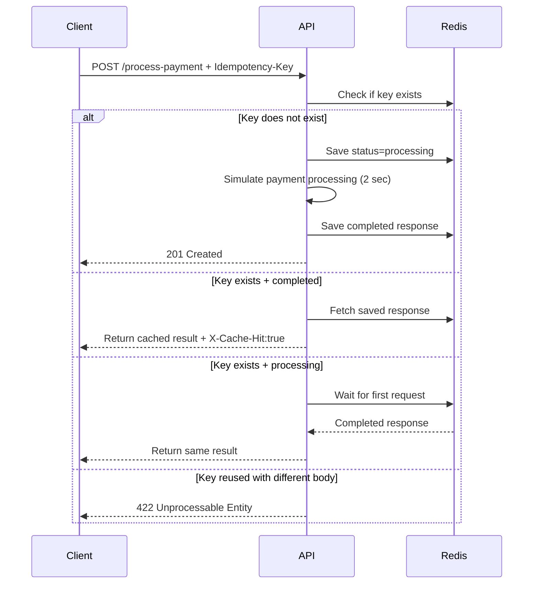
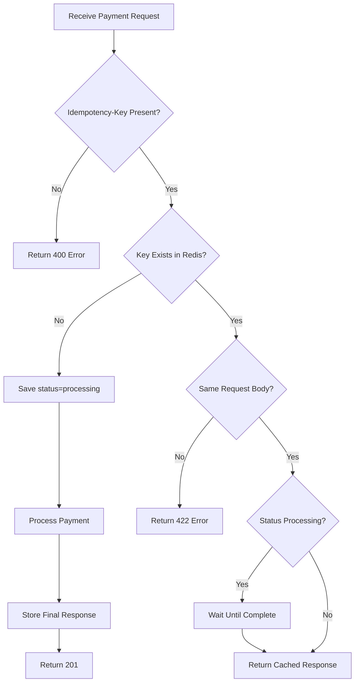

# Idempotency Gateway (Pay-Once Protocol)

A backend middleware service that prevents duplicate payment processing when clients retry requests due to timeouts or unstable networks.

This system guarantees that the same payment request with the same `Idempotency-Key` is processed **exactly once**.

---


# 🚀 Live Demo (Access Online)

**You can access and test the API live at:**

### Base URL
https://amalitech-deg-project-based-challenges-3i1r.onrender.com


### Interactive API Documentation (Swagger UI)
https://amalitech-deg-project-based-challenges-3i1r.onrender.com/docs

### Metrics Endpoint
https://amalitech-deg-project-based-challenges-3i1r.onrender.com/metrics

---

# Problem Statement

Payment clients sometimes retry requests when networks lag.

Without idempotency:

- Customer clicks Pay
- First request is slow
- Client retries
- Both requests get processed
- Customer gets charged twice

This project solves that problem.

---

# Features

- Prevent duplicate charges
- Replay previous successful responses
- Reject same key with modified body
- Handle concurrent duplicate requests safely
- Redis-backed storage
- Automatic key expiry (24h TTL)
- Metrics endpoint
- Dockerized setup

---

# Architecture Stack

- FastAPI
- Python 3.11
- Redis
- Docker Compose

---

# Sequence Diagram



---

# Flowchart



---

# Setup Instructions

This project can run using **Docker (recommended)** or **locally without Docker**.

---

# 🚀 Option 1: Run with Docker (Recommended)

This is the easiest and production-like setup.

## 1. Clone Repository

```bash
git clone https://github.com/Shadidu-Waako/AmaliTech-DEG-Project-based-challenges
```

## 2. Run Project

```bash
docker compose up --build
```

## 3. Access the application

- API → http://localhost:8000  
- Swagger Docs → http://localhost:8000/docs  
- Metrics → http://localhost:8000/metrics  

---

# 💻 Option 2: Run Locally (No Docker)

## 🐧 Linux / macOS

### 1. Create a virtual environment

```bash
python3 -m venv venv
source venv/bin/activate
```

### 2. Install dependencies

```bash
pip install -r requirements.txt
```

### 3. Install Redis

```bash
sudo apt install redis -y
sudo systemctl start redis
```

### 4. Run Project

```bash
uvicorn main:app --reload
```

---

## 🪟 Windows (PowerShell / CMD)

### 1. Create a virtual environment

```powershell
python -m venv venv
venv\Scripts\activate
```

### 2. Install dependencies

```powershell
pip install -r requirements.txt
```

### 3. Install Redis (Windows options)

#### Option A (Recommended): Use Docker Redis
```bash
docker run -d -p 6379:6379 redis
```

#### Option B: WSL (Ubuntu on Windows)
Install Redis inside WSL:
```bash
sudo apt update
sudo apt install redis -y
sudo service redis start
```

### 4. Run Project

```powershell
uvicorn main:app --reload
```

---

# 📦 Requirements

Make sure your `requirements.txt` contains:

```
fastapi
uvicorn
redis
pydantic
```

---

# . Access the application

- API → http://localhost:8000  
- Swagger Docs → http://localhost:8000/docs  
- Metrics → http://localhost:8000/metrics  

---

# 🧠 Tip

Docker setup is the **recommended production path**, while local setup is provided for development flexibility across Linux, macOS, and Windows.

---

# Access URLs

## API Root

```text
http://localhost:8000
```

## Swagger Docs

```text
http://localhost:8000/docs
```

## Metrics

```text
http://localhost:8000/metrics
```

---

# API Documentation

---

## POST /process-payment

### Headers

```http
Idempotency-Key: pay123
Content-Type: application/json
```

### Body

```json
{
  "amount": 100,
  "currency": "UGX"
}
```

---

## First Request Response

```json
{
  "message": "Charged 100 UGX"
}
```

Status:

```text
201 Created
```

---

## Duplicate Request Response

Same key + same payload:

```json
{
  "message": "Charged 100 UGX"
}
```

Header:

```http
X-Cache-Hit: true
```

---

## Different Payload Same Key

```json
{
  "detail": "Idempotency key already used for a different request body."
}
```

Status:

```text
422 Unprocessable Entity
```

---

# Metrics Endpoint

## GET /metrics

Response:

```json
{
  "processed": 3,
  "cache_hits": 5,
  "conflicts": 1
}
```

---

# Design Decisions

## Why Redis?

Redis was selected because it provides:

- Fast key-value lookups
- Atomic operations (`SETNX`)
- Expiry support (TTL)
- Suitable for distributed systems

## Why Request Hashing?

SHA256 hash of request body ensures a key cannot be reused for another payment.

## Why In-Flight Waiting?

If duplicate requests arrive simultaneously:

- First request processes
- Second request waits
- Both receive same final result

This prevents race-condition double charging.

---

# Developer's Choice Feature

## TTL Expiry (24 Hours)

Idempotency keys automatically expire after 24 hours.

Benefits:

- Prevents unlimited storage growth
- Realistic payment gateway behavior
- Reduces stale data accumulation

---

# Example cURL Test

```bash
curl -X POST http://localhost:8000/process-payment \
-H "Content-Type: application/json" \
-H "Idempotency-Key: pay001" \
-d '{"amount":100,"currency":"UGX"}'
```

Run the same command twice to test replay behavior.

---

# Author

Waako Shadidu Ismail
